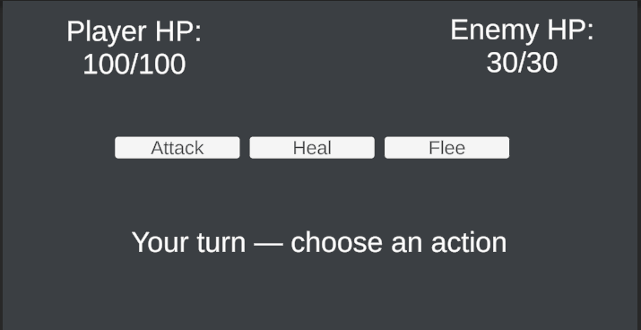

# ⚔️ Modular Turn-Based Combat System for Unity

A clean, decoupled, and highly customizable turn-based combat engine for Unity. Designed with RPGs and Roguelites in mind, this system uses ScriptableObjects for data management and UnityEvents for UI separation, ensuring maximum performance and flexibility.

## ✨ Features
* **Decoupled Architecture:** The combat logic is 100% independent of the UI. Connect your own canvas, sliders, and buttons easily via the Unity Inspector.
* **ScriptableObject Data:** Enemies are generated from data containers (`EnemyData`), saving memory and making it easy for designers to create new monsters without touching the code.
* **Classic RPG Mechanics:** Built-in support for Attack, Heal, and Flee actions (with success probability calculations).
* **Plug & Play:** Drop the components into your scene, link the UnityEvents, and start battling in minutes.

## 🛠️ Architecture Overview
This package is built around 4 core scripts:
1. `EnemyData.cs`: ScriptableObject blueprint for enemy stats (HP, Damage, Loot).
2. `EnemyStats.cs`: The live combat instance of an enemy.
3. `PlayerStats.cs`: Component managing the player's health, damage, and inventory.
4. `TurnBasedCombatManager.cs`: The core engine handling the turn cycle and triggering UI events.

## 🚀 How to Use
1. Import the scripts into your Unity project.
2. Create an Enemy blueprint by right-clicking in the Project window: `Create > TurnBasedCombat > Enemy Data`.
3. Add the `PlayerStats` component to your Player GameObject.
4. Add the `TurnBasedCombatManager` to an empty GameObject.
5. Link your UI text and buttons to the Manager's UnityEvents in the Inspector. 
6. Call `StartCombat(playerStats, enemyData)` to initiate the battle!

---

### 👨‍💻 About the Developer
Hi! I'm Gonzalo, a Game Development student passionate about writing clean, modular, and easy-to-use code for Unity. 

**Looking for modular assets for your game?** I am available for freelance work! I focus on creating and adapting specific, well-structured micro-systems (like this turn-based combat, inventory setups, or specific controllers) to save indie developers time. If you need a customized version of this system or other specific modular tools, let's talk!

📫 **Contact me on Fiverr:** [Insert your link here]
